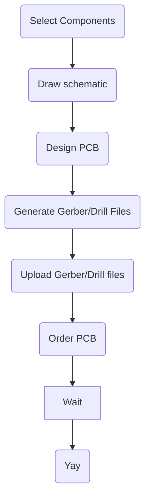
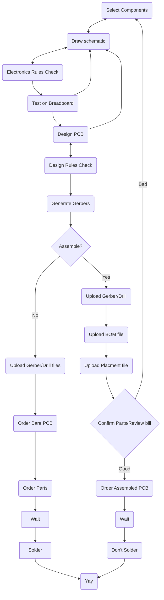

# How to build a PCB
Ok, you've decided that your project could benefit from a PCB. Now what? It's
just a few simple steps:

Of course, that's only what happens in an ideal situation. Because you're bound
to make mistakes along the way, it won't be a linear process and will look more
like this:

## Select Components
If you've built projects on breadboards/stripboards/perfboards, you already
know something about this, but things are a little different.

### Through hole vs surface mount
When you are doing something with a grid of 100mil holes, you're limited to
through-hole components. If you want a SMT component (or just something with a
different pitch), the solution is to buy a dev board which adapts to the
standard for breadboards.

Now you're entering a new and more flexible world. There are a *lot* more of
components available when you're building a PCB. In fact, if you're doing PCB
assembly, there might be a surcharge for having to deal with THT. And the THT
components themselves are likely to be more expensive than their SMT
counterparts.

That said, the THT components might be easier to work with if you're planning
to assemble yourself; but bear in mind Seattle Makers has a reflow oven to help
members assemble SMT projects. It's also possible to solder larger SMT
components with hot air or a soldering iron.

### Part availability
If you are planning to have your PCB assembled, you should be aware that the
manufacturer you're working with needs to have access to the part. So
not-for-new-design parts might be scarce. Also be aware that parts come in
"reels" or tape and there is generally a charge to have the spool mounted on
the pick-n-place machine. Also look out for planning to use components which
have low stock counts.

### Metadata
As you pick parts, you will want to track:
* The datasheet
* The manufacturer
* The manufacturer's part number
* Part numbers for the PCB fabricator
* eCAD assets:
    * Symbol
    * Footprint
    * 3d model (not strictly required, but useful).

> This is where the integration EasyEDA/LCSC/JLCPCB really shines. You shop on
LCSC for a part, get the number, and go to EasyEDA to place the part. You can
just search for the LCSC part number and go from there. All the data gets
added.
>
> But even if you plan to use EasyEDA, you will need to do some of this if you
want to be able to order from some other manufacturer.

## Draw schematic

This is where you design your circuit. You place components, connect pins, etc.
The actual layout is not relevant; your goal is to be clear about what the
circuit is.

### Net labels
One thing people might not be familiar with are *net labels*. You're probably
familiar with `GND` or `VCC` being placed as a symbol, but you can do that for
any net.  Rather than draw a line from one pin to another, it's possible to
connect to a label marker and that logically connects to other label markers
with the same value. This helps the schematic look less cluttered but it's also
useful in cases where you attach a GPIO pin to a device. If you later decide to
use a different GPIO pin because it make the PCB layout easier, it's easy to
switch and doesn't require extra lines being deleted and redrawn.

## Electronics Rules Check (ERC)
> I don't think this is available in EasyEDA.

This is an incantation used to ward off the magic smoke. You are going to spend
a bunch of time, money and energy on your PCB. It would be a shame if you
shorted `VCC` to `GND`. This basically helps you make sure all the pins are
connected (or marked a not-connected), that you don't connect two "power output"
pins and the like. It isn't magic, but it is prudent to run occasionally when
you are designing your circuit and especially when you think you're ready to
move past that phase.

You're in control; you can choose to ignore violations if you think they
are not helping you.

## Test on Breadboard
Just like the ERC, it's generally smart to try to discover problems earlier in
the process than later. One of the big advantages of PCBs is that they can
handle more complex circuits than you would want to build on a breadboard.
But you should see what validation you can do.

## Design PCB
This is the core part of it. Once you've told the EDA what the components
you want to use are what their footprints are, and how they are connected,
you get to decide where to physically place the components and connect
pads. You also get to define the silkscreen layer. And, of course, you
get to define the boarders of the board and give it its shape.

## Design Rules Check (DRC)
Just like the ERC, there is a way to have the software make sure the
board can be manufactured. It checks things like the nets are the right width and are spaced with enough clearance from other nets. It also confirms that
you don't have silkscreen on the pads or overlapping other silkscreen.

Also like the ERC, if you decide to ignore the violations, the software won't
put up a fight. But you might get asked to revise your board.

## Generate Gerbers
The next step is to generate Gerber files and Excellon drill files. Basically,
Gerbers are vector files (like SVG) which tell the manufacturer where the
copper, soldermask, silkscreen should exist or not on the board. Likewise the
Excellon files define where to drill holes.

There are viewers for these files, but you will essentially see what you saw in
the PCB design software.

Typically, these get uploaded as a zip file to the manufacturer.

> Once again, the EasyEDA/JLCPCP/LCSC synergy works for you here. This
all happens behind the scenes in that case. But if you want to use
EasyEDA with other PCB manufacturers, it supports making Gerbers/Excellon
files like other EDAs.

## Assemble?
You needed to know if you were going to get your board assembled earlier
in the process when you were picking components. But this is where it
really makes a difference. If you are ordering an assembled board, you
need a *Bill of Materials* (BOM) and a *placement file*.

### When does assembly make sense?
Getting your board assembled can save a lot of labor and is less error prone.
But there are trade-offs. Generally, you have to buy 5 boards. Even if you only
want 1 board, the extra $4 or so you'll spend on boards you don't use is
probably not going to be significant relative to the overall cost of the
project. However, when you start adding components to the mix, the additional
cost starts to add up.

Also, relative some other soldering projects, putting components in the holes
and soldering them tends to be quick and easy. Each solder joint only takes a
second or so.

## Order PCB
The process varies from manufacturer to manufacturer.

Once you have the files you need and know who you want to order from, you visit
their website, upload Gerber/Excellon files, and then get to select things like
board thickness, copper thickness, soldermask color, HASL vs ENIG finish, etc.

Your choices can make a significant impact on cost and delivery time.

### Order Assembly (optional)

Once you have the board set up the way you want, you can add on assembly. To do
that you need to provide the BOM and placement files. The website will
generally try to match your BOM with components it knows about and give you a
list of what you'll get. In some cases, it may need you to search for the
component you wanted.

For components like resistors and capacitors, you can generally substitute for
others with the same footprint.

## Final Order
Before you commit to ordering the board, it may be worthwhile sending the files
to other manufacturers to see what the cost and timelines are.

But once you pay, there will generally be a review by an engineer at the
manufacturer to confirm they can actually build the board. If there's an
issue, they will put your order on hold and give you a chance to correct it.
Otherwise, you just have to wait for the delivery.
